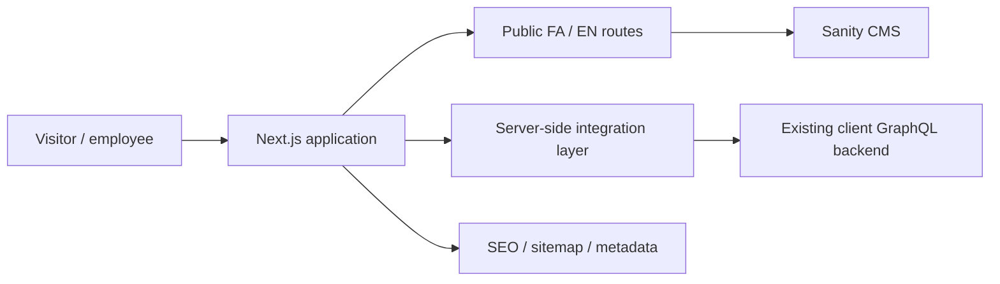

# FarazAndishan — Client Project Case Study

A sanitized portfolio case study for a bilingual corporate and HR platform built with Next.js, React, TypeScript, Sanity CMS, and GraphQL integration.

The production source repository remains private because this was client work.

## Overview

FarazAndishan combines a public corporate website, HR service pages, editorial content, lead-generation flows, and a protected personnel area.

My contribution included:

- responsive frontend implementation
- Persian and English experiences
- RTL / LTR layout support
- reusable components and page sections
- corporate and HR service pages
- blog and editorial integration
- contact and consultation flows
- protected personnel screens
- server-side GraphQL integration
- Sanity CMS integration
- SEO-oriented routing and metadata
- production-readiness work

## Architecture



A core architectural decision was to separate public editorial content from private operational functionality.

- Sanity handles public editorial content.
- The existing client backend remains the source of truth for protected personnel functionality.
- Next.js server routes mediate backend calls and normalize data for the UI.

## Tech stack

| Area | Technology |
| --- | --- |
| Framework | Next.js App Router |
| Frontend | React, TypeScript |
| CMS | Sanity |
| Backend integration | GraphQL through a server-side boundary |
| Styling | CSS Modules / responsive layout system |
| Localization | Persian + English, RTL/LTR-aware |
| SEO | metadata, canonical URLs, sitemap, robots, JSON-LD |
| Tooling | npm, ESLint, TypeScript |
| Quality | type-checking, linting, production builds, CI |

## Key engineering challenges

### Bilingual UI

The interface needed to support both Persian and English while keeping a consistent information architecture.

**Approach**
- locale-based public routes
- shared page structure
- RTL/LTR-aware components
- shared ASCII route slugs
- locale-aware metadata

### Existing backend integration

The frontend had to integrate with an existing GraphQL system rather than replacing it.

**Approach**
- server-side integration layer
- normalized UI-facing data
- protected operations handled on the server
- clear separation between frontend and backend responsibilities

### Large information architecture

The platform includes multiple service groups, nested HR pages, corporate services, blog content, and two languages.

**Approach**
- reusable page and section components
- governed route structures
- shared content models
- separation between content, presentation, and integration logic

## SEO and internationalization

The project includes:

- Persian and English localized routes
- canonical URL support
- alternate locale metadata
- sitemap generation
- robots configuration
- structured metadata
- JSON-LD support
- CMS-driven editorial metadata

## Quality workflow

```text
Install dependencies
      ↓
TypeScript type-check
      ↓
ESLint
      ↓
Next.js production build
      ↓
Sanity Studio type-check
      ↓
Sanity Studio production build
```

## More detail

- [Architecture notes](docs/architecture.md)
- [Engineering decisions](docs/engineering-decisions.md)
- [Recruiter summary](docs/recruiter-summary.md)

## What this project demonstrates

- real client project experience
- production-oriented Next.js architecture
- bilingual responsive frontend development
- React and TypeScript
- CMS integration
- GraphQL integration
- protected application areas
- complex information architecture
- SEO implementation
- release-quality validation

## Source availability

The full implementation is intentionally private because it contains client-specific architecture and internal project material.

This repository is a sanitized public case study only.

## About me

**Sogand Hamidpour**  
Computer Science & AI student · Full-Stack Developer

GitHub: [@itsherhere](https://github.com/itsherhere)
