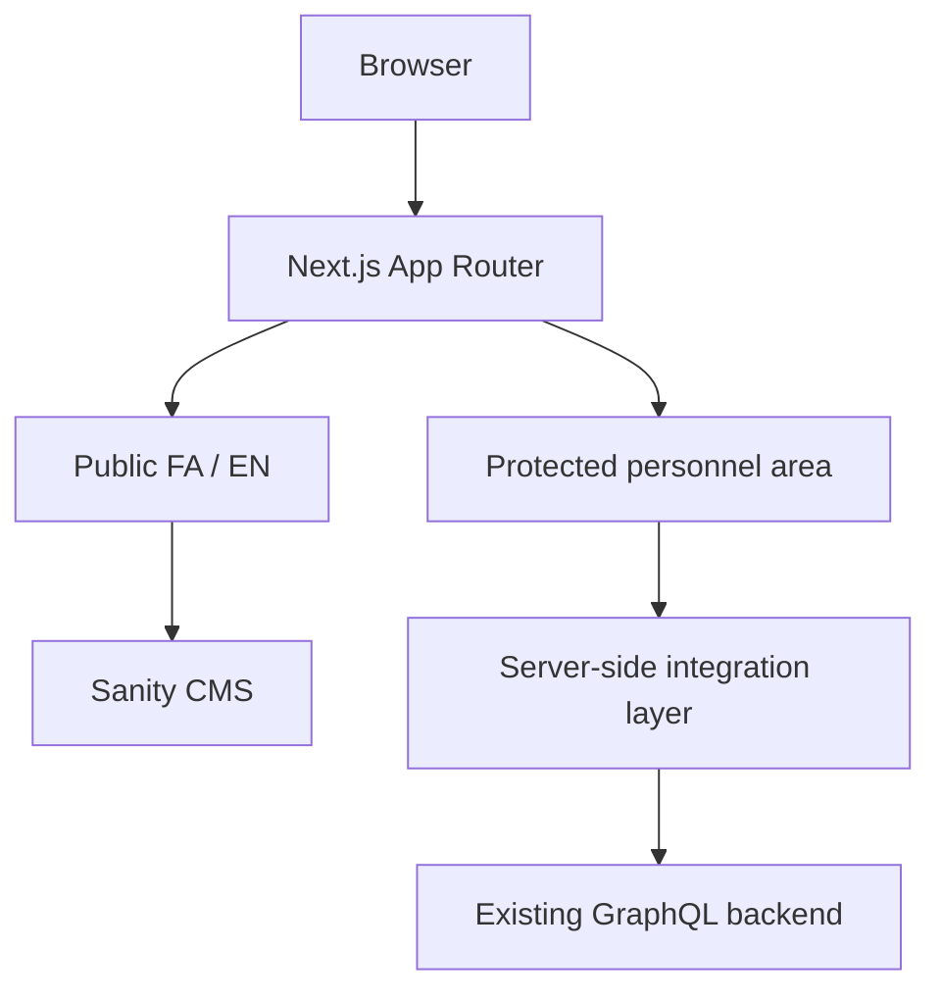

# Architecture Notes

FarazAndishan is organized around three layers:

1. Public bilingual website
2. Sanity CMS for editorial content
3. Protected personnel area connected to the client's existing GraphQL backend

## Main decisions

- Public editorial content is managed in Sanity.
- Protected personnel functionality stays connected to the existing client backend.
- Next.js server-side code acts as the integration boundary.
- Persian and English share the same overall information architecture.
- Reusable UI primitives reduce duplication across service pages.

## Quality checks

The private production repository validates:

- TypeScript
- ESLint
- Next.js production build
- Sanity Studio type-check
- Sanity Studio production build
